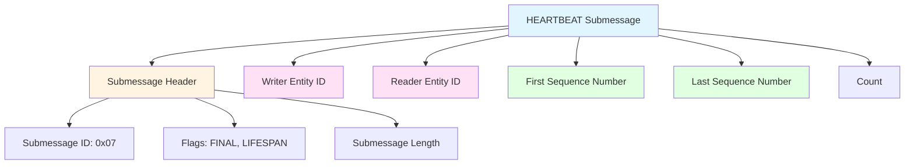
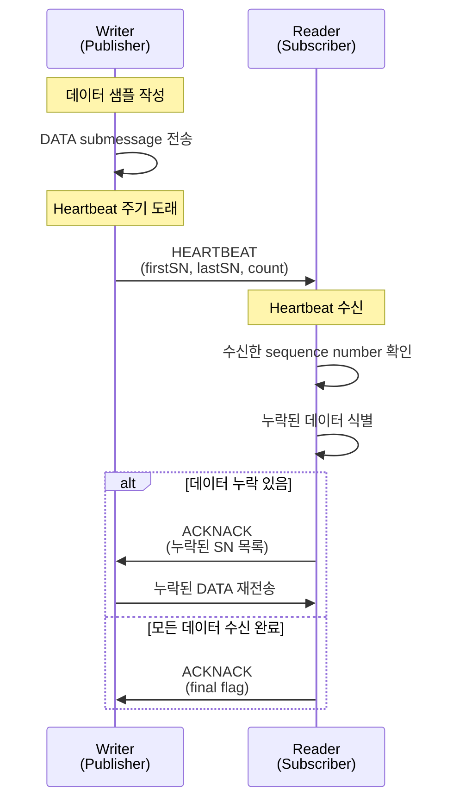
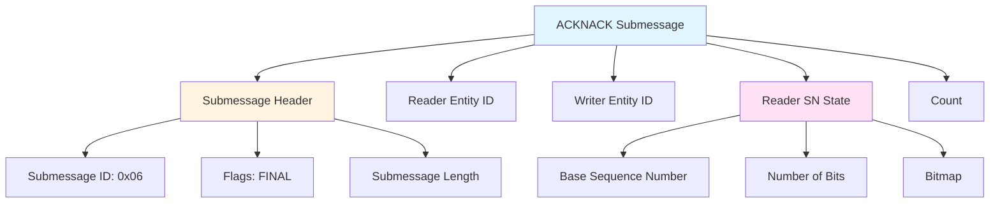
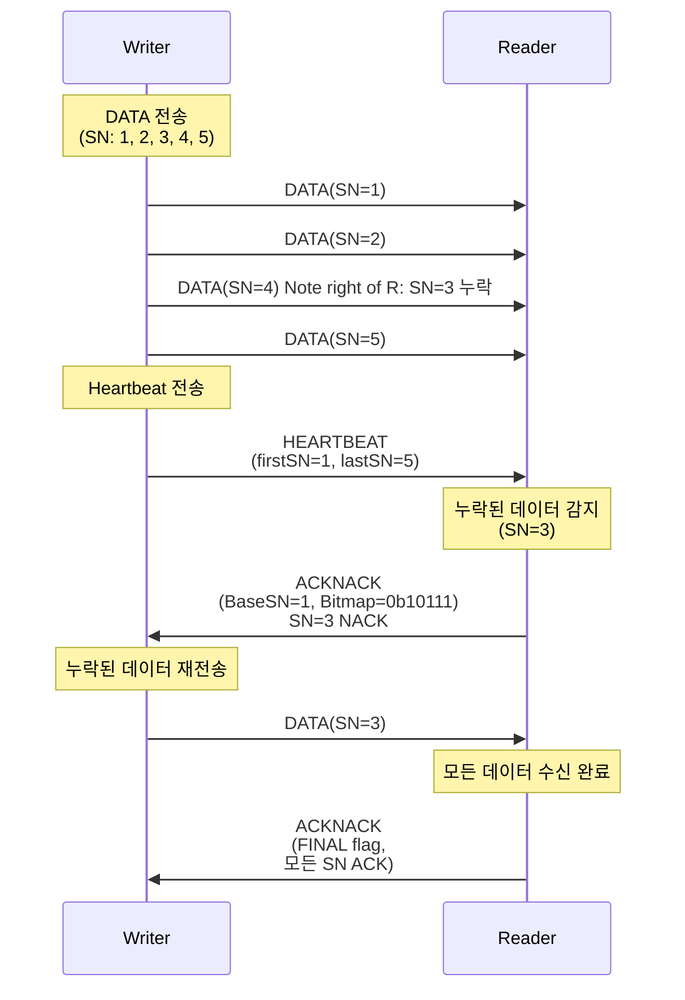
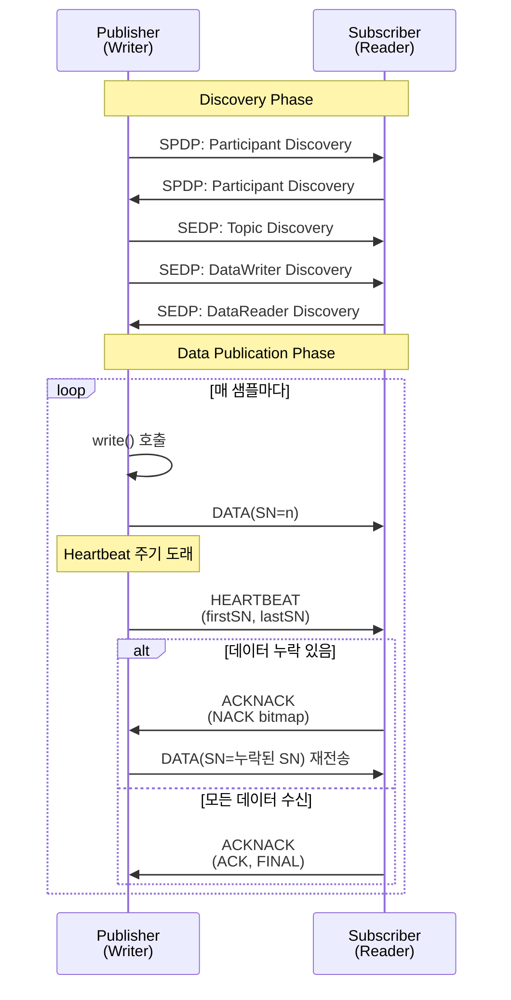
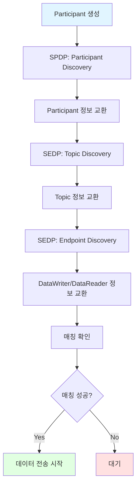

# PCAP Analysis: DDS RTPS Protocol Deep Dive

## Overview

이 문서는 `publisher.pcap`과 `subscriber.pcap` 파일을 기반으로 DDS RTPS (Real-Time Publish-Subscribe) 프로토콜의 동작을 상세히 분석합니다. 특히 **Heartbeat**, **ACK (Acknowledgment)**, **NACK (Negative Acknowledgment)** 메커니즘에 중점을 둡니다.

### Capture Information

- **Topic**: `MessageTopic`
- **Data Type**: `Message` (IDL struct with `id: long` and `content: string<256>`)
- **QoS Profile**: `BuiltinQosLibExp::Pattern.ReliableStreaming`
- **Transport**: Shared Memory (shmem)
- **Publisher Packets**: ~9,550 packets
- **Subscriber Packets**: ~10,819 packets
- **Domain ID**: 0

### RTPS Protocol Overview

RTPS는 OMG DDS (Data Distribution Service) 표준의 네트워크 프로토콜입니다. UDP/IP 또는 shared memory를 통해 reliable한 데이터 전송을 보장합니다.

## RTPS Protocol Structure

### RTPS Message Format

RTPS 메시지는 다음 구조로 구성됩니다:

```
┌─────────────────────────────────────────┐
│ RTPS Header                             │
│  - Protocol ID: "RTPS"                  │
│  - Protocol Version: 2.5                 │
│  - Vendor ID                             │
│  - GUID Prefix                           │
└─────────────────────────────────────────┘
┌─────────────────────────────────────────┐
│ RTPS Submessage(s)                      │
│  - Submessage Header                    │
│  - Submessage Data                      │
└─────────────────────────────────────────┘
```

### RTPS Submessage Types

주요 RTPS Submessage 타입:

1. **DATA**: 실제 데이터 샘플 전송
2. **HEARTBEAT**: Writer가 Reader에게 데이터 가용성 알림
3. **ACKNACK**: Reader가 Writer에게 수신 확인 또는 누락 알림
4. **GAP**: Writer가 Reader에게 특정 sequence number 범위가 전송되지 않음을 알림
5. **INFO_DST**: 목적지 정보
6. **INFO_TS**: 타임스탬프 정보

## Publisher PCAP Analysis

### Publisher Traffic Pattern

Publisher는 다음 순서로 RTPS 메시지를 전송합니다:

1. **Discovery Phase**: Participant, Topic, DataWriter 정보 공개
2. **Data Publication Phase**: 주기적으로 DATA submessage 전송
3. **Heartbeat Phase**: 주기적으로 HEARTBEAT submessage 전송

### Key Observations from publisher.pcap

#### 1. Discovery Messages

Publisher는 자신의 존재와 capabilities를 알리기 위해 discovery 메시지를 전송합니다:

```
- Participant Discovery: MessageParticipant 정보
- Topic Discovery: MessageTopic 정보
- Endpoint Discovery: MessagePublisher (DataWriter) 정보
```

#### 2. DATA Submessages

실제 데이터 샘플은 DATA submessage로 전송됩니다:

```
DATA Submessage Structure:
├── Submessage Header
│   ├── Submessage ID: DATA
│   ├── Flags (INLINE_QOS, DATA_FLAG, KEY_FLAG 등)
│   └── Submessage Length
├── Entity ID (Writer GUID)
├── Sequence Number
├── Serialized Payload (Message struct)
└── Inline QoS (optional)
```

#### 3. HEARTBEAT Submessages

Publisher는 주기적으로 HEARTBEAT를 전송하여 Reader에게 데이터 가용성을 알립니다.

## Subscriber PCAP Analysis

### Subscriber Traffic Pattern

Subscriber는 다음 순서로 RTPS 메시지를 전송/수신합니다:

1. **Discovery Phase**: Participant, Topic, DataReader 정보 공개 및 수신
2. **Data Reception Phase**: DATA submessage 수신
3. **ACKNACK Phase**: 수신 확인 또는 누락 알림 전송

### Key Observations from subscriber.pcap

#### 1. Discovery Response

Subscriber는 Publisher의 discovery 메시지에 응답합니다:

```
- Participant Discovery: MessageParticipant 정보 교환
- Topic Discovery: MessageTopic 정보 수신
- Endpoint Discovery: MessageSubscriber (DataReader) 정보 공개
```

#### 2. ACKNACK Submessages

Subscriber는 수신한 데이터에 대해 ACKNACK를 전송합니다.

## Heartbeat Mechanism 상세 분석

### Heartbeat의 목적

**Heartbeat**는 RTPS 프로토콜에서 Writer가 Reader에게 자신이 보유한 데이터의 상태를 주기적으로 알리는 메커니즘입니다. Heartbeat를 통해:

1. **데이터 가용성 알림**: Writer가 특정 sequence number 범위의 데이터를 보유하고 있음을 알림
2. **Liveliness 확인**: Writer가 활성 상태임을 증명
3. **Missing data 감지**: Reader가 누락된 데이터를 식별할 수 있게 함

### Heartbeat Submessage Structure



### Heartbeat Flags

- **FINAL Flag**: 이 Heartbeat가 마지막인지 여부
- **LIFESPAN Flag**: LIFESPAN QoS와 관련된 정보 포함 여부

### Heartbeat Flow Diagram



### Heartbeat 동작 원리

1. **Writer의 Heartbeat 전송**:
   - Writer는 주기적으로 (일반적으로 `heartbeat_period` QoS 설정에 따라) HEARTBEAT를 전송합니다
   - HEARTBEAT에는 현재 보유한 데이터의 sequence number 범위가 포함됩니다:
     - `firstSN`: 보유한 데이터의 첫 번째 sequence number
     - `lastSN`: 보유한 데이터의 마지막 sequence number
     - `count`: Heartbeat의 카운터 (중복 감지용)

2. **Reader의 Heartbeat 수신**:
   - Reader는 HEARTBEAT를 수신하면 자신이 수신한 sequence number와 비교합니다
   - `firstSN`과 `lastSN` 사이에 누락된 데이터가 있는지 확인합니다

3. **Missing Data 감지**:
   - Reader가 누락된 sequence number를 발견하면 ACKNACK를 전송하여 재전송을 요청합니다

### Heartbeat와 Reliable QoS

이 예제는 `ReliableStreaming` QoS profile을 사용하므로:

- **Reliability**: 모든 데이터가 전달되어야 함
- **Heartbeat 주기**: Reliable 전송을 위해 정기적인 Heartbeat가 필수
- **Missing Data Recovery**: Heartbeat를 통해 누락된 데이터를 감지하고 복구

## ACK/NACK Mechanism 상세 분석

### ACKNACK의 목적

**ACKNACK (Acknowledgment/Negative Acknowledgment)**는 Reader가 Writer에게 데이터 수신 상태를 알리는 메커니즘입니다:

- **ACK**: 특정 sequence number까지의 데이터를 성공적으로 수신했음을 알림
- **NACK**: 특정 sequence number의 데이터가 누락되었음을 알림

### ACKNACK Submessage Structure



### ACKNACK Flags

- **FINAL Flag**: 이 ACKNACK가 마지막 응답인지 여부
- **Reader wants to be Final**: Reader가 더 이상 응답을 받지 않겠다는 의도

### ACKNACK Bitmap Mechanism

ACKNACK는 효율적인 누락 데이터 전달을 위해 bitmap을 사용합니다:

```
Reader SN State:
├── Base Sequence Number: 기준 sequence number
├── Number of Bits: bitmap의 크기
└── Bitmap: 각 bit가 해당 sequence number의 수신 여부를 나타냄
    - 0: 수신 완료 (ACK)
    - 1: 누락됨 (NACK, 재전송 필요)
```

예시:
```
Base SN: 100
Number of Bits: 8
Bitmap: 0b11001100

의미:
- SN 100: 수신 완료 (ACK)
- SN 101: 수신 완료 (ACK)
- SN 102: 누락 (NACK) ← 재전송 필요
- SN 103: 누락 (NACK) ← 재전송 필요
- SN 104: 수신 완료 (ACK)
- SN 105: 수신 완료 (ACK)
- SN 106: 누락 (NACK) ← 재전송 필요
- SN 107: 누락 (NACK) ← 재전송 필요
```

### ACKNACK Flow Diagram



### ACK vs NACK

#### ACK (Acknowledgment)

- **목적**: 특정 sequence number까지의 데이터를 성공적으로 수신했음을 알림
- **형태**: ACKNACK의 bitmap에서 해당 bit가 0으로 설정됨
- **효과**: Writer는 ACK된 데이터를 버퍼에서 제거할 수 있음

#### NACK (Negative Acknowledgment)

- **목적**: 특정 sequence number의 데이터가 누락되었음을 알림
- **형태**: ACKNACK의 bitmap에서 해당 bit가 1로 설정됨
- **효과**: Writer는 NACK된 데이터를 재전송함

### ACKNACK와 Reliable 전송

Reliable QoS에서는:

1. **모든 데이터 전달 보장**: NACK를 통해 누락된 데이터를 반드시 재전송
2. **순서 보장**: Sequence number를 통해 데이터 순서 유지
3. **중복 제거**: Sequence number를 통해 중복 수신 감지 및 제거

## Complete RTPS Communication Flow

### 전체 통신 흐름도



### Discovery Phase 상세



## Packet Analysis: Hex Dump Interpretation

### RTPS Header 분석

Publisher pcap에서 확인된 RTPS 헤더:

```
0x0070:  f400 0900 0101 00c0 03f4 5254 5053 0205
         └─┬─┘ └─┬─┘ └─┬─┘ └─┬─┘ └─┬─┘ └─┬─┘ └─┬─┘
           │     │     │     │     │     │     │
           │     │     │     │     │     │     └─ Protocol Version: 2.5
           │     │     │     │     │     └─ Protocol ID: "RTPS"
           │     │     │     │     └─ Vendor ID
           │     │     │     └─ Flags
           │     │     └─ Submessage ID
           │     └─ Submessage Length
           └─ Submessage Header
```

### GUID (Globally Unique Identifier) 분석

RTPS에서 각 Entity는 GUID로 식별됩니다:

```
GUID = GUID Prefix + Entity ID

GUID Prefix: 3034 edd2 46eb 8c09 0212
Entity ID: Writer/Reader별로 고유
```

Publisher와 Subscriber는 서로 다른 GUID Prefix를 가지며, 이를 통해 서로를 식별합니다.

## QoS Profile Impact on RTPS Behavior

### ReliableStreaming Profile의 영향

이 예제에서 사용된 `BuiltinQosLibExp::Pattern.ReliableStreaming` profile은 다음 RTPS 동작에 영향을 미칩니다:

1. **Reliability QoS**: 
   - `RELIABLE`: 모든 데이터가 전달되어야 함
   - Heartbeat와 ACKNACK를 통한 누락 데이터 복구 필수

2. **History QoS**:
   - `KEEP_LAST`: 최근 N개 샘플만 유지
   - Writer는 최근 샘플들을 버퍼에 보관하여 재전송 가능

3. **Resource Limits QoS**:
   - 버퍼 크기 제한
   - Heartbeat 주기 조정

4. **Writer/Reader Liveliness QoS**:
   - Heartbeat를 통한 liveliness 확인

## Performance Considerations

### Heartbeat 주기 최적화

- **너무 짧은 주기**: 네트워크 오버헤드 증가
- **너무 긴 주기**: Missing data 감지 지연, 복구 시간 증가
- **권장**: 애플리케이션 요구사항에 따라 조정 (일반적으로 수백 ms ~ 수 초)

### ACKNACK 효율성

- **Bitmap 크기**: 큰 범위의 누락 데이터를 효율적으로 전달
- **FINAL Flag**: 불필요한 응답 방지
- **Count 필드**: 중복 ACKNACK 감지

## Troubleshooting Guide

### 일반적인 문제와 해결

1. **데이터 누락**:
   - Heartbeat 주기 확인
   - ACKNACK 수신 여부 확인
   - 네트워크 상태 확인

2. **높은 네트워크 트래픽**:
   - Heartbeat 주기 증가
   - History depth 감소
   - Batch 전송 고려

3. **느린 데이터 전달**:
   - ACKNACK 응답 지연 확인
   - Writer 버퍼 크기 확인
   - 네트워크 대역폭 확인

## Conclusion

이 PCAP 분석을 통해 DDS RTPS 프로토콜의 핵심 메커니즘을 이해할 수 있습니다:

1. **Heartbeat**: Writer가 Reader에게 데이터 가용성을 주기적으로 알림
2. **ACKNACK**: Reader가 Writer에게 수신 상태를 알리고 누락 데이터를 요청
3. **Reliable 전송**: Heartbeat와 ACKNACK를 통한 데이터 전달 보장

이러한 메커니즘들이 협력하여 DDS의 reliable한 데이터 전송을 보장합니다.

## References

- OMG DDS Interoperability Wire Protocol Specification (RTPS)
- RTI Connext DDS User's Manual
- DDS QoS Policies Reference Guide

