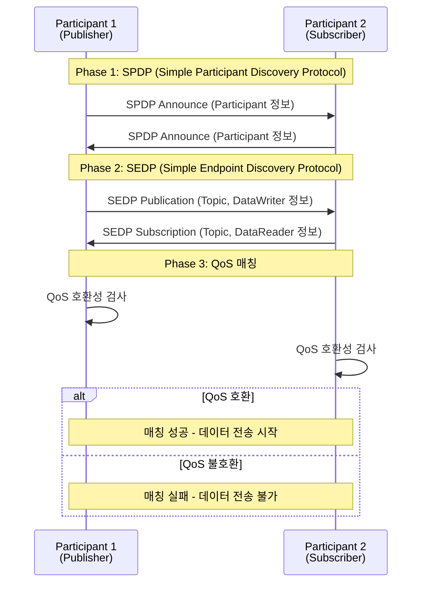

# DDS Discovery Snapshot 상세 분석

이 문서는 DDS Discovery Snapshot 기능을 통해 생성된 XML 파일들을 상세히 분석하고, DDS Discovery 메커니즘의 동작 원리를 설명합니다.

## 목차

1. [Discovery Snapshot 개요](#discovery-snapshot-개요)
2. [Participant Snapshot 분석](#participant-snapshot-분석)
3. [DataWriter Snapshot 분석](#datawriter-snapshot-분석)
4. [DDS Discovery 프로토콜 상세 설명](#dds-discovery-프로토콜-상세-설명)
5. [QoS 매칭과 불일치 분석](#qos-매칭과-불일치-분석)
6. [GUID (Globally Unique Identifier) 이해](#guid-globally-unique-identifier-이해)
7. [Locator와 Transport 이해](#locator와-transport-이해)
8. [실제 시나리오 분석](#실제-시나리오-분석)

---

## Discovery Snapshot 개요

Discovery Snapshot은 DDS 시스템의 discovery 상태를 특정 시점에 캡처하여 XML 파일로 저장하는 기능입니다. 이를 통해:

- **Discovery 상태 분석**: 어떤 Participant, Topic, Endpoint가 발견되었는지 확인
- **QoS 매칭 문제 진단**: 왜 Writer와 Reader가 매칭되지 않는지 파악
- **네트워크 토폴로지 이해**: 시스템의 실제 연결 구조 파악
- **디버깅**: Discovery 관련 문제 해결

---

## Participant Snapshot 분석

### 파일: `publisher_participant_snapshot.xml`

```xml
----------------------------------------------------------------------------
Participant guid="0x0101A04D,0x0507D2C4,0x30B0CFA2:0x000001C1" 
domain_id=0 
name="discovery_snapshotParticipant" 
role="discovery_snapshotParticipantRole" 
----------------------------------------------------------------------------
Matched Participants:
----------------------------------------------------------------------------
guid="0x0101D33D,0xEA8BB281,0x3C43BEE2:0x000001C1" 
name="discovery_snapshotParticipant" 
role="discovery_snapshotParticipantRole" 
unicastLocators="udpv4://192.168.55.245:7411 udpv4://172.17.0.1:7411 shmem://58FC:D028:FBA1:52C4:B144:5F54:0000:0000:7411" 
securityStatus="AUTHENTICATION_UNINITIATED" 
----------------------------------------------------------------------------
```

### 상세 분석

#### 1. Participant GUID 구조

```
guid="0x0101A04D,0x0507D2C4,0x30B0CFA2:0x000001C1"
```

GUID는 4개의 32비트 정수로 구성됩니다:

```
[Prefix 1] [Prefix 2] [Prefix 3] : [Entity ID]
0x0101A04D  0x0507D2C4  0x30B0CFA2  :  0x000001C1
```

**GUID 구성 요소:**

- **Prefix (0x0101A04D, 0x0507D2C4, 0x30B0CFA2)**: 
  - Participant를 고유하게 식별하는 96비트 prefix
  - 일반적으로 호스트의 MAC 주소나 IP 주소 기반으로 생성
  - 같은 Participant 내의 모든 Entity는 동일한 prefix를 공유

- **Entity ID (0x000001C1)**:
  - Participant의 Entity ID는 항상 `0x000001C1` (0xC1 = 193)
  - 이는 DDS 표준에서 정의한 Participant의 고정 Entity ID
  - DataWriter는 `0x80000003` (3번째 Writer)
  - DataReader는 `0x80000004` (4번째 Reader)

**Entity ID 패턴:**
- `0x000001C1`: DomainParticipant
- `0x000001C2`: Built-in Topic DataWriter
- `0x000001C7`: Built-in Topic DataReader
- `0x80000001`, `0x80000002`, ...: User-defined DataWriter (홀수)
- `0x80000002`, `0x80000004`, ...: User-defined DataReader (짝수)

#### 2. Domain ID

```
domain_id=0
```

- **Domain ID**: DDS Domain을 식별하는 숫자 (0~232-1)
- 같은 Domain ID를 가진 Participant만 서로 discover 가능
- Domain은 논리적 네트워크 분리 메커니즘
- 다른 Domain의 Participant는 서로 통신하지 않음

#### 3. Participant Name과 Role

```
name="discovery_snapshotParticipant"
role="discovery_snapshotParticipantRole"
```

- **Name**: Participant의 사용자 정의 이름 (디버깅/모니터링용)
- **Role**: Participant의 역할 식별자
- 이 정보는 QoS 설정에서 지정되며, RTI Tools에서 표시됨

#### 4. Matched Participants

```
guid="0x0101D33D,0xEA8BB281,0x3C43BEE2:0x000001C1"
```

이것은 **다른 Participant**입니다:

- **다른 GUID Prefix**: `0x0101D33D,0xEA8BB281,0x3C43BEE2` (Subscriber의 Participant)
- **같은 Entity ID**: `0x000001C1` (모든 Participant는 동일)
- **같은 Domain ID**: 둘 다 domain 0에 속함

**Discovery 의미:**
- Publisher의 Participant가 Subscriber의 Participant를 발견했음
- 두 Participant는 같은 Domain에 있으므로 서로 discover 가능
- Participant discovery는 SPDP (Simple Participant Discovery Protocol)를 통해 수행

#### 5. Unicast Locators

```
unicastLocators="udpv4://192.168.55.245:7411 udpv4://172.17.0.1:7411 shmem://58FC:D028:FBA1:52C4:B144:5F54:0000:0000:7411"
```

**Locator**는 네트워크 주소와 포트를 나타냅니다:

1. **udpv4://192.168.55.245:7411**
   - UDP IPv4 transport
   - IP 주소: 192.168.55.245 (로컬 네트워크 인터페이스)
   - 포트: 7411 (DDS 기본 포트 + domain_id)

2. **udpv4://172.17.0.1:7411**
   - Docker 네트워크 인터페이스 (있는 경우)
   - 또는 다른 네트워크 인터페이스

3. **shmem://58FC:D028:FBA1:52C4:B144:5F54:0000:0000:7411**
   - Shared Memory transport
   - 같은 머신에서 실행되는 경우 가장 빠른 통신 방법
   - 포트: 7411

**Transport 선택:**
- DDS는 여러 transport를 동시에 사용 가능
- 같은 머신: Shared Memory 우선 사용
- 다른 머신: UDP/IP 사용
- 자동으로 최적의 transport 선택

#### 6. Security Status

```
securityStatus="AUTHENTICATION_UNINITIATED"
```

- **AUTHENTICATION_UNINITIATED**: 보안이 활성화되지 않음
- DDS Security가 활성화되면 다른 값들이 표시됨

---

## DataWriter Snapshot 분석

### 파일: `publisher_datawriter_snapshot.xml`

```xml
----------------------------------------------------------------------------
Writer guid="0x0101A04D,0x0507D2C4,0x30B0CFA2:0x80000003" 
topic="Example DiscoverySnapshot" 
type="DiscoverySnapshot" 
keyed_type="false" 
name="discovery_snapshotDataWriter" 
----------------------------------------------------------------------------
Matched Readers:
----------------------------------------------------------------------------
(Empty)
----------------------------------------------------------------------------
Not Matched Readers (on the Same Topic):
----------------------------------------------------------------------------
guid="0x0101D33D,0xEA8BB281,0x3C43BEE2:0x80000004" 
name="discovery_snapshotDataReader" 
unicastLocators="udpv4://192.168.55.245:7411 udpv4://172.17.0.1:7411 shmem://58FC:D028:FBA1:52C4:B144:5F54:0000:0000:7411" 
incompatibility="QoS" 
----------------------------------------------------------------------------
```

### 상세 분석

#### 1. Writer GUID

```
guid="0x0101A04D,0x0507D2C4,0x30B0CFA2:0x80000003"
```

- **Prefix**: `0x0101A04D,0x0507D2C4,0x30B0CFA2` (Participant와 동일)
- **Entity ID**: `0x80000003` (3번째 Writer)
  - `0x80000000` 이상은 User-defined Entity
  - 홀수는 DataWriter, 짝수는 DataReader

#### 2. Topic 정보

```
topic="Example DiscoverySnapshot"
type="DiscoverySnapshot"
keyed_type="false"
```

- **Topic Name**: "Example DiscoverySnapshot"
- **Type Name**: "DiscoverySnapshot" (IDL에서 정의한 타입)
- **Keyed Type**: false (Key가 없는 타입)
  - Key가 있으면 같은 key를 가진 인스턴스가 하나로 관리됨
  - Key가 없으면 모든 샘플이 독립적

#### 3. Matched Readers: (Empty)

**매칭된 Reader가 없음** - 이것이 핵심 문제입니다!

#### 4. Not Matched Readers

```
guid="0x0101D33D,0xEA8BB281,0x3C43BEE2:0x80000004"
incompatibility="QoS"
```

**같은 Topic이지만 QoS 불일치로 매칭되지 않음:**

- **Reader GUID**: Subscriber의 DataReader
- **같은 Topic**: "Example DiscoverySnapshot"
- **같은 Type**: "DiscoverySnapshot"
- **incompatibility="QoS"**: QoS 설정이 호환되지 않음

---

## DDS Discovery 프로토콜 상세 설명

### Discovery 단계

DDS Discovery는 여러 단계로 진행됩니다:



### 1. SPDP (Simple Participant Discovery Protocol)

**목적**: 다른 Participant를 발견

**동작:**
1. 각 Participant는 주기적으로 SPDP 메시지를 multicast로 전송
2. SPDP 메시지에는:
   - Participant GUID
   - Domain ID
   - Locator 정보
   - Participant QoS

3. 다른 Participant가 SPDP 메시지를 받으면:
   - Participant를 발견한 것으로 기록
   - SEDP 단계로 진행

**포트:**
- 기본 포트: 7400 + domain_id * 250
- Domain 0: 포트 7400

### 2. SEDP (Simple Endpoint Discovery Protocol)

**목적**: Topic, DataWriter, DataReader를 발견

**동작:**
1. Participant가 발견되면 SEDP 메시지 교환 시작
2. Publisher는 다음을 알림:
   - Topic 정보 (이름, 타입)
   - DataWriter 정보 (GUID, QoS)

3. Subscriber는 다음을 알림:
   - Topic 정보 (이름, 타입)
   - DataReader 정보 (GUID, QoS)

**포트:**
- 기본 포트: 7410 + domain_id * 250
- Domain 0: 포트 7410

### 3. QoS 매칭 (Quality of Service Matching)

**목적**: Writer와 Reader의 QoS가 호환되는지 확인

**매칭 규칙:**

1. **Topic 매칭**:
   - Topic 이름이 같아야 함
   - Type 이름이 같아야 함

2. **Reliability QoS**:
   - Writer: RELIABLE → Reader: RELIABLE 또는 BEST_EFFORT 가능
   - Writer: BEST_EFFORT → Reader: BEST_EFFORT만 가능

3. **Durability QoS**:
   - Writer: VOLATILE → Reader: VOLATILE, TRANSIENT_LOCAL, TRANSIENT, PERSISTENT 가능
   - Writer: TRANSIENT_LOCAL → Reader: TRANSIENT_LOCAL, TRANSIENT, PERSISTENT 가능
   - Writer: TRANSIENT → Reader: TRANSIENT, PERSISTENT 가능
   - Writer: PERSISTENT → Reader: PERSISTENT만 가능

4. **Ownership QoS**:
   - Writer: SHARED → Reader: SHARED만 가능
   - Writer: EXCLUSIVE → Reader: EXCLUSIVE만 가능
   - **이 예제의 문제**: Writer는 SHARED (기본값), Reader는 EXCLUSIVE → 불일치!

5. **Partition QoS**:
   - Partition 이름이 겹쳐야 함 (최소 하나)

6. **Deadline QoS**:
   - Writer의 deadline ≥ Reader의 deadline

7. **Liveliness QoS**:
   - Writer의 liveliness ≥ Reader의 liveliness

---

## QoS 매칭과 불일치 분석

### 현재 상황 분석

**Writer QoS (기본값):**
```xml
<datawriter_qos>
    <publication_name>
        <name>discovery_snapshotDataWriter</name>
    </publication_name>
    <!-- Ownership QoS가 명시되지 않음 → 기본값: SHARED -->
</datawriter_qos>
```

**Reader QoS (설정됨):**
```xml
<datareader_qos>
    <subscription_name>
        <name>discovery_snapshotDataReader</name>
    </subscription_name>
    <ownership>
        <kind>DDS_EXCLUSIVE_OWNERSHIP_QOS</kind>
    </ownership>
</datareader_qos>
```

### Ownership QoS 불일치

**Ownership QoS**는 데이터 소유권을 제어합니다:

- **SHARED Ownership**:
  - 여러 Writer가 같은 데이터를 쓸 수 있음
  - 모든 Writer의 데이터가 Reader에 전달됨
  - 기본값

- **EXCLUSIVE Ownership**:
  - 한 번에 하나의 Writer만 "소유"할 수 있음
  - Owner Strength가 높은 Writer의 데이터만 전달됨
  - Owner Strength가 같으면 가장 최근에 쓴 Writer가 소유

**매칭 규칙:**
- Writer: SHARED ↔ Reader: SHARED ✅
- Writer: EXCLUSIVE ↔ Reader: EXCLUSIVE ✅
- Writer: SHARED ↔ Reader: EXCLUSIVE ❌ (현재 상황)
- Writer: EXCLUSIVE ↔ Reader: SHARED ❌

**해결 방법:**

1. **Writer에 EXCLUSIVE 설정:**
```xml
<datawriter_qos>
    <ownership>
        <kind>DDS_EXCLUSIVE_OWNERSHIP_QOS</kind>
    </ownership>
</datawriter_qos>
```

2. **Reader에서 EXCLUSIVE 제거 (기본값 SHARED 사용):**
```xml
<datareader_qos>
    <!-- Ownership QoS 제거 → 기본값 SHARED 사용 -->
</datareader_qos>
```

---

## GUID (Globally Unique Identifier) 이해

### GUID 구조

```
GUID = GUID Prefix (96 bits) + Entity ID (32 bits)
```

### GUID Prefix 생성

GUID Prefix는 일반적으로 다음 중 하나로 생성:

1. **MAC 주소 기반**:
   - 호스트의 MAC 주소를 기반으로 생성
   - 같은 머신의 모든 Participant는 다른 prefix를 가질 수 있음

2. **IP 주소 기반**:
   - IP 주소를 기반으로 생성
   - 네트워크 인터페이스별로 다를 수 있음

3. **랜덤 생성**:
   - 완전히 랜덤하게 생성
   - 충돌 가능성은 매우 낮음

### Entity ID 할당

**Built-in Entities:**
- `0x000001C1`: DomainParticipant
- `0x000001C2`: DCPSParticipant (Built-in)
- `0x000001C7`: DCPSPublication (Built-in)
- `0x000001C8`: DCPSSubscription (Built-in)

**User-defined Entities:**
- DataWriter: `0x80000001`, `0x80000003`, `0x80000005`, ... (홀수)
- DataReader: `0x80000002`, `0x80000004`, `0x80000006`, ... (짝수)

### GUID의 중요성

1. **고유성**: 전 세계적으로 고유한 식별자
2. **라우팅**: 데이터를 올바른 Endpoint로 전달
3. **Discovery**: Endpoint를 식별하고 매칭
4. **디버깅**: 문제 발생 시 특정 Entity 추적

---

## Locator와 Transport 이해

### Locator 구조

```
<transport>://<address>:<port>
```

### Transport 종류

1. **UDP/IP (udpv4, udpv6)**:
   - 가장 일반적인 transport
   - 네트워크를 통한 통신
   - Multicast 지원

2. **Shared Memory (shmem)**:
   - 같은 머신 내 통신
   - 가장 빠른 통신 방법
   - 메모리 복사만으로 데이터 전달

3. **TCP (tcpv4, tcpv6)**:
   - 신뢰성 있는 연결
   - WAN 통신에 적합

4. **TLS (tlsv4)**:
   - 암호화된 통신
   - 보안이 필요한 경우

### Locator 예시 분석

```
udpv4://192.168.55.245:7411
```

- **udpv4**: UDP IPv4 transport
- **192.168.55.245**: IP 주소 (로컬 네트워크)
- **7411**: 포트 번호
  - 기본 포트: 7400 + domain_id * 250
  - Domain 0: 7400
  - DataWriter/Reader: 7411 (7400 + 11)

### Multiple Locators

한 Endpoint는 여러 Locator를 가질 수 있습니다:

```
unicastLocators="udpv4://192.168.55.245:7411 udpv4://172.17.0.1:7411 shmem://..."
```

**의미:**
- 여러 네트워크 인터페이스에 바인딩
- DDS가 자동으로 최적의 transport 선택
- 같은 머신: Shared Memory 우선
- 다른 머신: UDP/IP 사용

---

## 실제 시나리오 분석

### 시나리오: QoS 불일치로 인한 매칭 실패

**타임라인:**

1. **t=0s**: Publisher 시작
   - Participant 생성
   - Topic 생성
   - DataWriter 생성 (SHARED ownership)

2. **t=1s**: Subscriber 시작
   - Participant 생성
   - Topic 생성
   - DataReader 생성 (EXCLUSIVE ownership)

3. **t=2s**: SPDP Discovery
   - 두 Participant가 서로 발견
   - Participant Snapshot에 표시됨

4. **t=3s**: SEDP Discovery
   - Writer와 Reader 정보 교환
   - Topic은 매칭됨 (같은 이름, 같은 타입)

5. **t=4s**: QoS 매칭 시도
   - Ownership QoS 불일치 발견
   - 매칭 실패
   - DataWriter Snapshot에 "Not Matched"로 표시

6. **t=5s**: 데이터 전송 시도
   - Writer는 데이터를 전송
   - Reader는 데이터를 받지 못함 (매칭되지 않음)

### Discovery Snapshot의 가치

이 시나리오에서 Discovery Snapshot은:

1. **문제 진단**: QoS 불일치를 명확히 보여줌
2. **해결 방법 제시**: Ownership QoS를 맞춰야 함을 알려줌
3. **Discovery 상태 확인**: Participant는 발견되었지만 Endpoint는 매칭 실패

---

## 결론

Discovery Snapshot은 DDS 시스템을 이해하고 디버깅하는 강력한 도구입니다:

1. **Discovery 상태 파악**: 어떤 Entity가 발견되었는지 확인
2. **QoS 문제 진단**: 왜 매칭이 실패했는지 파악
3. **네트워크 이해**: Transport와 Locator 정보 확인
4. **시스템 문서화**: 현재 시스템 상태를 기록

이 예제에서는 **Ownership QoS 불일치**로 인해 Writer와 Reader가 매칭되지 않았지만, Discovery 자체는 성공적으로 수행되었습니다. Participant는 서로 발견했고, Topic 정보도 교환되었지만, QoS 불일치로 인해 실제 데이터 전송은 불가능한 상태입니다.

**학습 포인트:**
- DDS Discovery는 단계적으로 진행됨 (SPDP → SEDP → QoS 매칭)
- QoS 매칭은 엄격한 규칙을 따름
- Discovery Snapshot은 이러한 과정을 시각화함
- GUID, Locator, QoS는 DDS의 핵심 개념

---

## 참고 자료

- [RTI Connext DDS User's Manual - Discovery](https://community.rti.com/static/documentation/connext-dds/)
- [DDS Specification - Discovery](https://www.omg.org/spec/DDS/)
- [QoS Policy Reference](https://community.rti.com/static/documentation/connext-dds/7.3.0/doc/manuals/connext_dds_professional/users_manual/users_manual/QoSPolicies.htm)

